# PCMLAI-bankcampaign

## Overview

The projects aims to analyze the effectiveness of marketing campaigns, help increase the efficiency by identifying the main characteristics that affect success and help in better managemeent of limited resources. Our goal is to find a model that can help explain the success of a contact i.e. it the client subscribes the deposit. 

## Business Understanding

From a business perspective, the task is to identify key attributes that help determine the success of a customer contact. This involves leveraging the provided bank marketing campaign data set, conducting exploratory data analysis, preparing data, and using machine learning methods to identify features that may help determine whether a contact is successful or not. This analysis may be used further by the bank to fine tune its campaign strategy and resources.

### Data cleaning

Per the published by the researchers, the original data set represents, 17 campaign types that occurred between May 2008 and Nov 2010 and corresponds to 79354 contacts. The data provided to use for this analysis contains 41188 contacts or records. The location of the original data set is here
https://archive.ics.uci.edu/ml/datasets/bank+marketing

### Jupyter Notebook

The notebook used for this analysis is here:
https://github.com/mgk2014/PCMLAI-bankcampaign

### Data cleaning

- 12 duplicate rows were found that were removed
- Outliers were found in age, previous, and consumer confidence index. These were not removed, and were handled through Standard Scaler
- The data set did not have any null values
- pdays data was heavily skewed, and was removed from our data set
- Duration is already deemed to be a predictor of success and was removed from our analysis

### Exploratory Data Analysis

This is a very imbalanced data set with ~90% unsuccessful campaigns i.e. clients did not subscribe to term deposits. Analysis leverages class balancing techniques

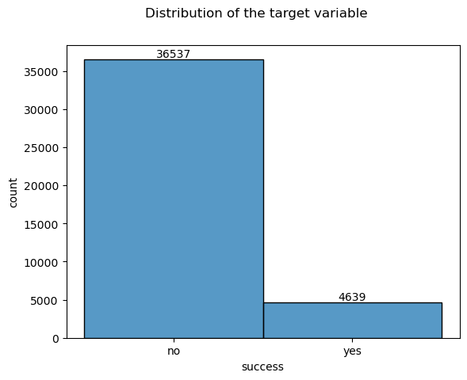

Age: Age appears to show higher acceptance rates with customers who are older
pdays: column does not have much variability, consider removing it
eurobir3m: eurobir (Euro Interbank Offered Rate: based on the average interest rates at which a large panel of European banks borrow funds from one another). It seems that if Eurobir rate is lower, there is a higher chance of accepttance of a term deposit

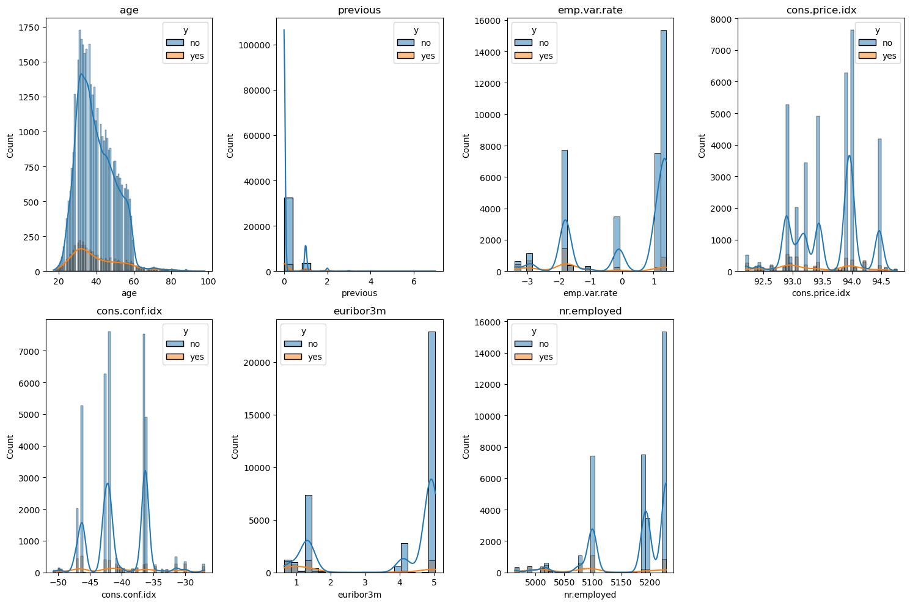

It appears that older people subscribe to term deposits more than younger people. Further analysis in the notebook indicates success with customers > 60 yrs of age is 45%, which is 35% higher than custoemrs who are less than 60 yrs of age

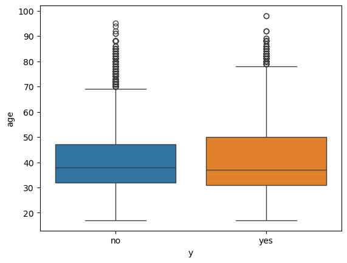

This was added to the EDA after doing the model evaluation. DT model indicates this feature as being the most important.
I do not fully understand the meaning of this column. Maybe it is the number of employees in the bank, if so, i am not sure how it affects the outcome of the campaigns. This requires further discussion with a SME. 

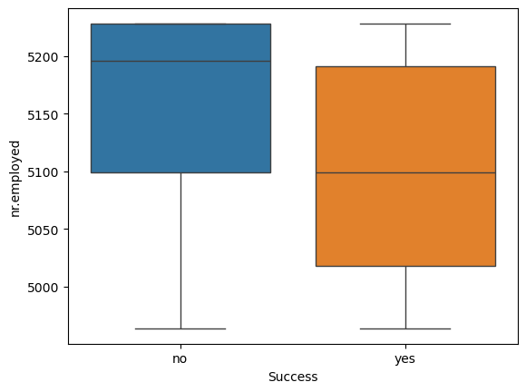

Correlation between numerical features - The societal numerical features - emp.var.rate, consumer price index, consumer confidence index are highly correlated to each other. On the flip side, as expected they have no correlation to the client information (age) or campaign info(duration, and campaign). From the correlation heatmap the euribor3m has a negative correlation to success, but it is not that high

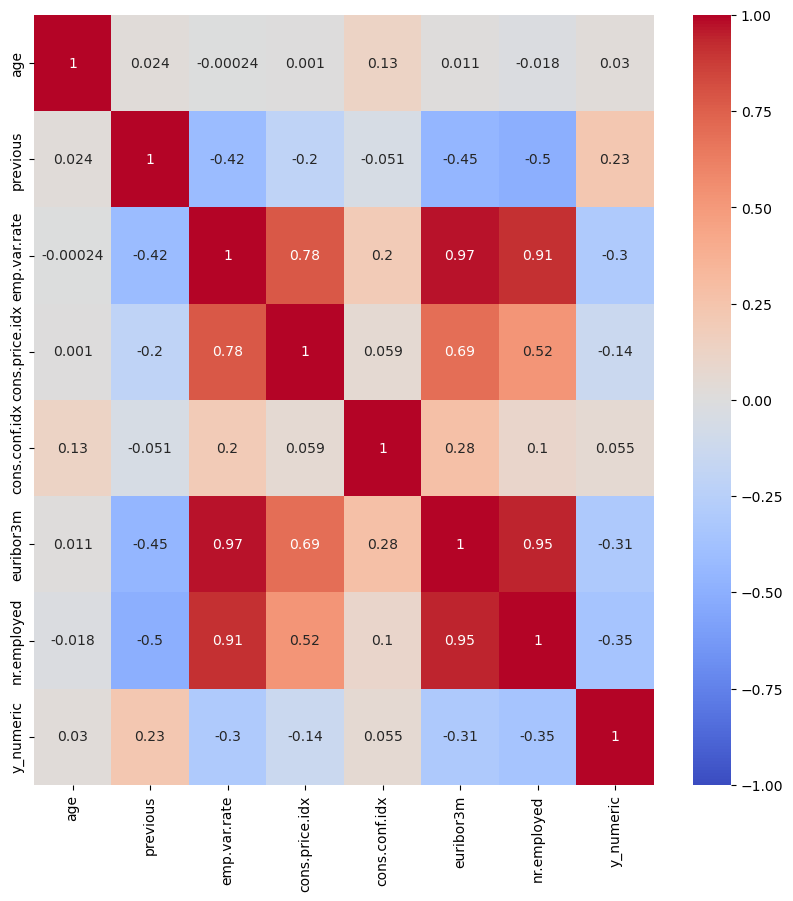

The customers who had accepted a term deposit before, have a higher chance of accepting a new term deposit

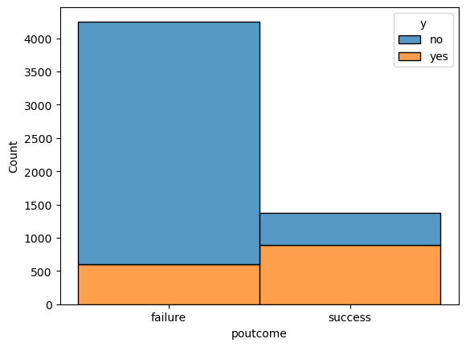

May has the highest calls made, however mar, jul appear to have low volume but higher success rates

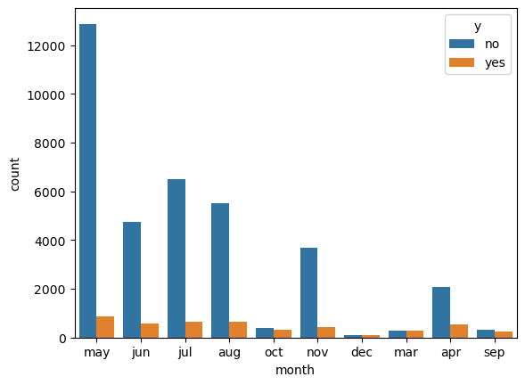

### Model development

- Categorical variables were encoded using OneHotEncoding

- Numerical columns were scaled using StandardScaler

- Default LogisticRegression, provided a AUC of 79% and classification summary, with a very low F1 score for the positive class

    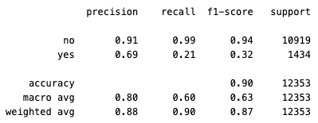

- OverSampling of KNN, LR, DT and SVM using SMOTE provided the following results

    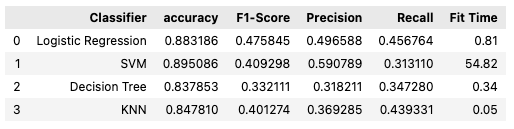

- Under sampling using RandomUnderSampler provided better results recall scores for all the models ~ 63%, **Logistic Regression** and **SVM** best performance and are pretty close on F1-Score. These classifiers with GridSearchCV and vary on hyper parameters

    

- Logistic Regression, DT and SVM were tried further with GridSearchCV. The details of these evaluations are present in the attached Jupyter notebook

    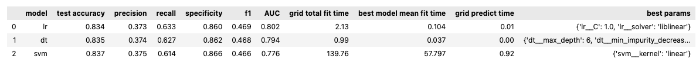

- ROC/AUC for all the models indicate LR to have the high AUC

    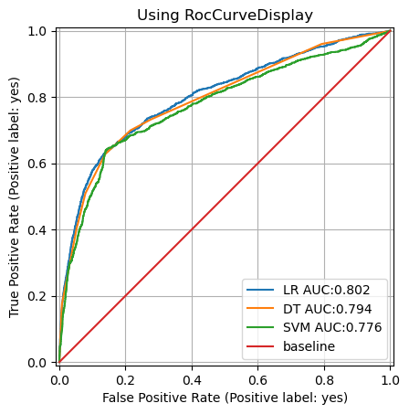

### Logistic Regression (chosen model)

- Grid Search CV was fed with the following parameters 'lr__solver': ['lbfgs', 'liblinear'],'lr__C': [0.0001, 0.0001, 0.001, 1.0], and suggested the following as the best parameters for the LR model: lr__C': 1.0, 'lr__solver': 'liblinear'

- Classification summary

    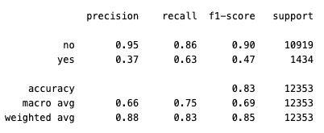

- Logistic Regression coeeficients were converted to log odds ratio. According to this model - Odds of success depend on consumer price index, euribor rates and success of prior outcomes. SVM placed higher emphasis on Euribor and consumer price index as well.

    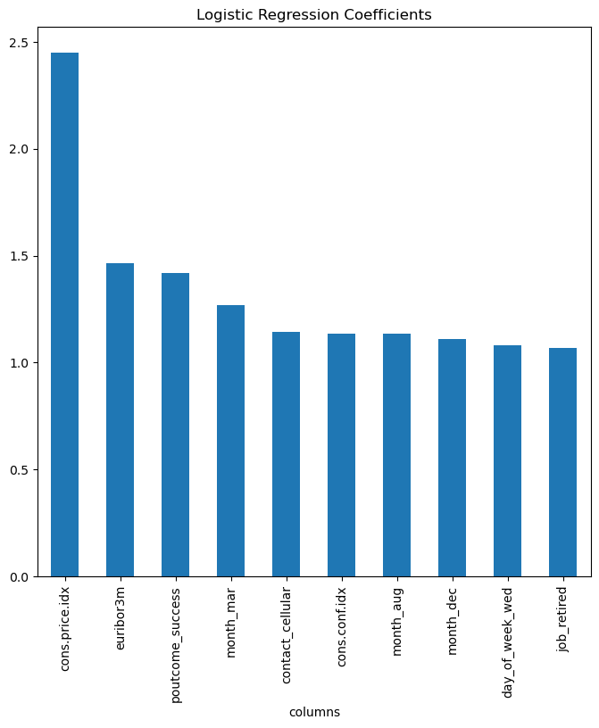

- Logistic Regression Confusion matrix

    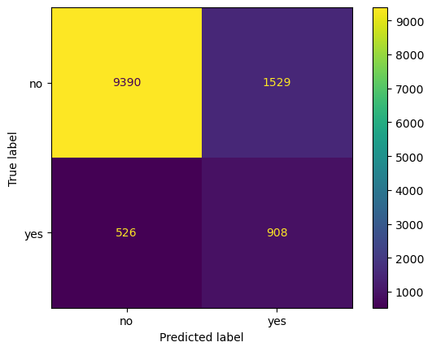

### Conclusion

- In our chosen model Logistic Regression - Undersampling helped improve the F1 scores, yet at 47% they remain quite low for the positive class. The precision was high for the negative class at 90% and F1 score of 90%
- This would imply that the chosen model will predict a lot of customers to purchase a certificate product, resulting in many false positives and impacting limited resources for the bank to do their outreach
- This model requires further refinement before it may be deployed by the bank

### Next steps

- Additional feature engineering may be done to improve the scores, such as with education and make it an ordinal categorical feature
- Understand the impact of Euribor and consumer price indices, with an SME, to understand the true impact of these features on customers buying decisions
- Undersampling reduced the dataset to 3k records each for train/test. Oversampling introduced noise in the data set that made the scores worse. Consider ways to acquire more data or other sampling techniques to address imbalance of classes
- Further hyper parameter tuning for models such as SVM with better compute systems